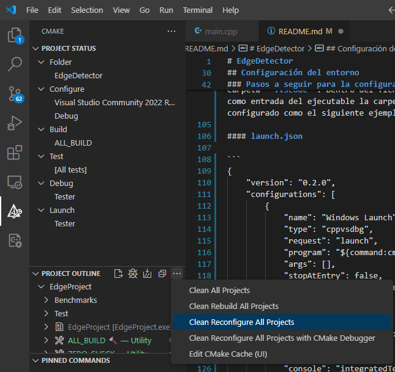
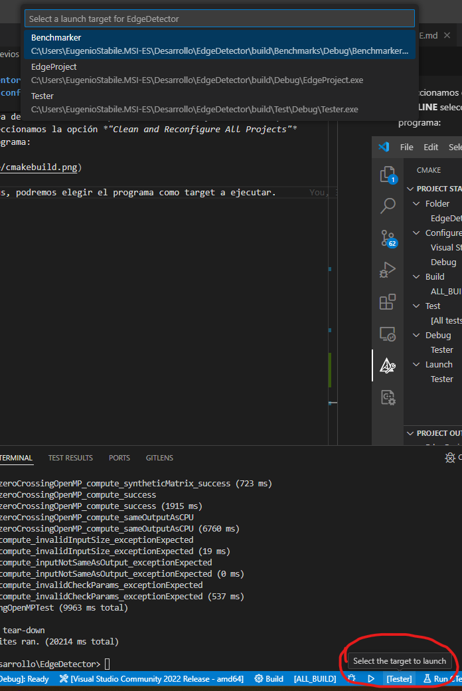
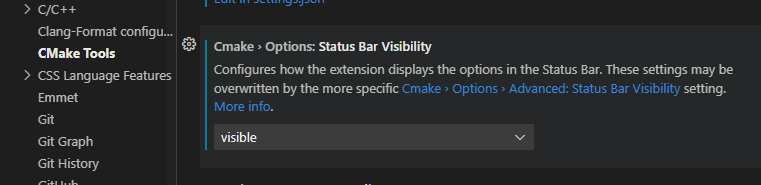
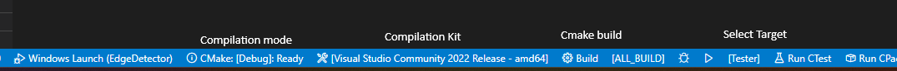

# EdgeDetector

## Project Structure Description

The project is composed of the following key components:

### Algorithm

- **EdgeDetector**: A component that manages the computation of edge detection algorithms and handles the input/output images.

### Unit Test

- **Test**: Contains unit tests for each configuration present in the project.
- **googletest**: Contains files for running the project's unit tests, developed by Google.
- **Resources**: Stores the input images and results obtained from running tests.

### Benchmarks

- **Benchmarks**: Measures the execution time of the edge detection algorithms and generates a detailed report on the performance of each algorithm.

The output is saved in the **Resources** folder under the name **Benchmarking.md**.

After compiling the project, two executables are created:

1. **Tester**: Executes a set of unit tests for the main program components.
2. **Benchmarker**: Measures the time taken by each algorithm under different configurations.


## Environment Pre-requisites 

The following tools must be installed:

- [CMake](https://cmake.org/download/)
- [Visual Studio Code](https://code.visualstudio.com/download)
- [OpenCV](https://opencv.org/releases/) (For Linux, follow step Nº2 in this [link](https://phoenixnap.com/kb/installing-opencv-on-ubuntu))
- [Git](https://git-scm.com/download/win)
- [GoogleTest](https://github.com/google/googletest)
- [Gdb](https://www.gdbtutorial.com/tutorial/how-install-gdb) (To use debug mode on Linux).


Additionally, for Windows, the MSVC compiler needs to be installed with the *“Desktop development with C++”* package. **If you already use C++ with Visual Studio, skip this step**.

To download the package, visit the [Visual Studio page](https://visualstudio.microsoft.com/es/downloads/), scroll down to the **Tools for Visual Studio** section in **All Downloads**, and select **Build Tools for Visual Studio 2022**.

After downloading, select the **Desktop development with C++** option and click on the install button.
With this, we would have the necessary tools to compile the C++ language in Windows.

*This project has been tested in the Visual Studio Code text editor, running Microsoft Windows 11 operating system.*


## Setup Steps 


1. **Ensure Read Permissions (Linux only)**: If you are using Linux, make sure that the images saved in **Resources** have read permissions.


2. **Download VS Code Extensions**: Once inside Visual Studio Code, download the following extensions:
    - C/C++: (ID: ms-vscode.cpptools)
    - Cmake Tools: (ID: ms-vscode.cmake-tools)


3. **Configure Environment Variables**: For Windows, define the following environment variables:


```
OPENCV_PATH: local installation path of OpenCV.
OPENCV_LIB_DIR: directory where the OpenCV libraries are located.
MSVC_PATH: local installation path of the Microsoft Visual C++ compiler. (cl.exe)
```

For Linux, as VSCode does not correctly detect environment variables, replace these directories with the absolute directories of GCC on your operating system.


4. **Modify c_cpp_properties.json File**: The c_cpp_properties.json file is located inside .vscode folder. This file configures the IntelliSense detection for the project headers and external libraries. If you are using Linux, you will need to adjust this file to include the local absolute path of your GCC installation:

#### c_cpp_properties.json:

```json
{
    "configurations": [
        {
            "name": "Win32",
            "includePath": [
                "${workspaceFolder}/EdgeDetector/include",
                "${workspaceFolder}/googletest/googletest/include",
                "${OPENCV_PATH}/include"
            ],
            "defines": [
                "_DEBUG",
                "UNICODE",
                "_UNICODE"
            ],
            "windowsSdkVersion": "10.0.22000.0",
            "compilerPath": "${MSVC_PATH}",
            "cStandard": "c11",
            "intelliSenseMode": "windows-msvc-x64",
            "configurationProvider": "ms-vscode.cmake-tools",
            "cppStandard": "c++17"
        },
        {
            "name": "Linux",
            "includePath": [
                "${workspaceFolder}/EdgeDetector/include",
                "${workspaceFolder}/googletest/googletest/include",
                "/usr/local/include/opencv4"  <- OpenCV path in my case
            ],
            "defines": [
                "_DEBUG",
                "UNICODE",
                "_UNICODE"
            ],
            "compilerPath": "/usr/bin/gcc",  <- GCC path in my case
            "cStandard": "gnu11",
            "intelliSenseMode": "linux-gcc-x64",
            "configurationProvider": "ms-vscode.cmake-tools",
            "cppStandard": "gnu++17"
        }
    ],
    "version": 4
}
```


5. **Modify the launcher**: On **.vscode** folder, (Linux case) there is a **launch.json** preconfigured. You just must change the GDB path for you GDB local instalation path. On Windows, is configured to compile with Microsoft Visual Studio Compiler.

#### launch.json

```json
{
    "version": "1.0.0",
    "configurations": [
        {
            "name": "Windows Launch",
            "type": "cppvsdbg",
            "request": "launch",
            "program": "${command:cmake.launchTargetPath}",
            "args": [],
            "stopAtEntry": false,
            "cwd": "${workspaceFolder}/Resources",
            "environment": [
                {
                    "name": "PATH",
                    "value": "${env:PATH}:${command:cmake.getLaunchTargetDirectory}"
                }
            ],
            "console": "integratedTerminal"
        },
        {
            "name": "Linux Launch",
            "type": "cppdbg",
            "request": "launch",
            "program": "${command:cmake.launchTargetPath}",
            "args": [],
            "stopAtEntry": false,
            "cwd": "${workspaceFolder}/Resources",
            "environment": [
                {
                    "name": "PATH",
                    "value": "$PATH:${command:cmake.getLaunchTargetDirectory}"
                }
            ],
            "externalConsole": false,
            "MIMode": "gdb",
            "setupCommands": [
                {
                    "description": "Enable pretty-printing for gdb",
                    "text": "-enable-pretty-printing",
                    "ignoreFailures": true
                }
            ],
            "miDebuggerPath": "/usr/bin/gdb"    <- GDB path in my case
        }
    ]
}
```

6. **Clean and Reconfigure All Projects**:  Select the **CMake** option in the activity bar. Then, in the **PROJECT OUTLINE** option, click on the three dots and select the “Clean and Reconfigure All Projects” option. This step is necessary for the program compilation.




7. **Choose the Target**: Look at the status bar, which is colored blue and located at the bottom of Visual Studio Code. Here, you can select the program as the target to execute.



On the same status bar, you have the option to change the Compilation Kit, the variant (Release, Debug), perform a CMake Build, etc.

If the status bar options are not visible, you can enable them in Settings. Navigate to:

`Settings -> Extensions -> CMakeTools -> Status Bar Visibility = Visible`




8. **Execute the Target**: Once everything is set up, press the **F5** key to execute the chosen target.




9. **Debug Mode**: If you want to use the **Debug** mode in Windows, put a breakpoint on the line you want to debug.